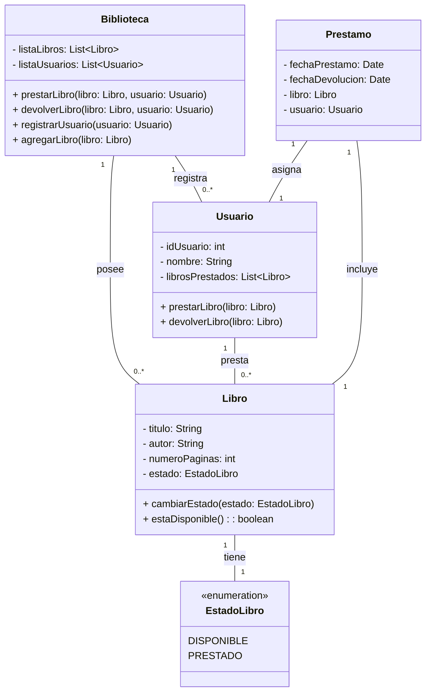

```mermaid

classDiagram
    class Biblioteca {
        - listaLibros: List~Libro~
        - listaUsuarios: List~Usuario~
        + prestarLibro(libro: Libro, usuario: Usuario)
        + devolverLibro(libro: Libro, usuario: Usuario)
        + registrarUsuario(usuario: Usuario)
        + agregarLibro(libro: Libro)
    }

    class Libro {
        - titulo: String
        - autor: String
        - numeroPaginas: int
        - estado: EstadoLibro
        + cambiarEstado(estado: EstadoLibro)
        + estaDisponible(): boolean
    }

    class Usuario {
        - idUsuario: int
        - nombre: String
        - librosPrestados: List~Libro~
        + prestarLibro(libro: Libro)
        + devolverLibro(libro: Libro)
    }

    class Prestamo {
        - fechaPrestamo: Date
        - fechaDevolucion: Date
        - libro: Libro
        - usuario: Usuario
    }

    class EstadoLibro {
    <<enumeration>>
    DISPONIBLE
    PRESTADO
    }

    Biblioteca "1" -- "0..*" Libro : posee
    Biblioteca "1" -- "0..*" Usuario : registra
    Usuario "1" -- "0..*" Libro : presta
    Prestamo "1" -- "1" Libro : incluye
    Prestamo "1" -- "1" Usuario : asigna
    Libro "1" -- "1" EstadoLibro : tiene

```
