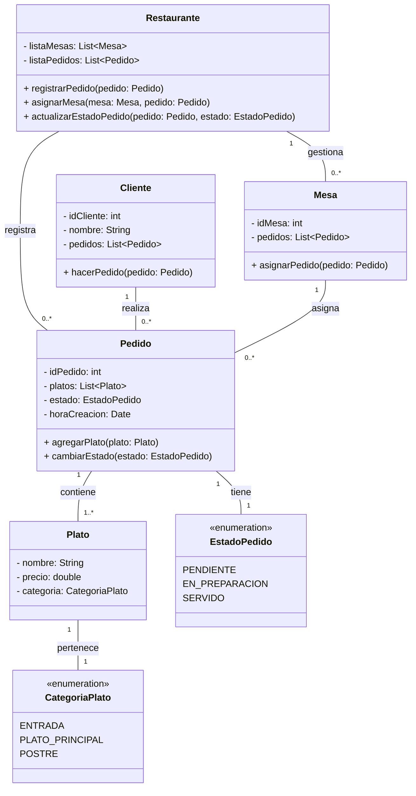

```mermaid

classDiagram
    class Restaurante {
        - listaMesas: List~Mesa~
        - listaPedidos: List~Pedido~
        + registrarPedido(pedido: Pedido)
        + asignarMesa(mesa: Mesa, pedido: Pedido)
        + actualizarEstadoPedido(pedido: Pedido, estado: EstadoPedido)
    }

    class Pedido {
        - idPedido: int
        - platos: List~Plato~
        - estado: EstadoPedido
        - horaCreacion: Date
        + agregarPlato(plato: Plato)
        + cambiarEstado(estado: EstadoPedido)
    }

    class Plato {
        - nombre: String
        - precio: double
        - categoria: CategoriaPlato
    }

    class Mesa {
        - idMesa: int
        - pedidos: List~Pedido~
        + asignarPedido(pedido: Pedido)
    }

    class Cliente {
        - idCliente: int
        - nombre: String
        - pedidos: List~Pedido~
        + hacerPedido(pedido: Pedido)
    }

    class EstadoPedido {
        <<enumeration>>
        PENDIENTE
        EN_PREPARACION
        SERVIDO
    }

    class CategoriaPlato {
        <<enumeration>>
        ENTRADA
        PLATO_PRINCIPAL
        POSTRE
    }

    Restaurante "1" -- "0..*" Mesa : gestiona
    Restaurante "1" -- "0..*" Pedido : registra
    Cliente "1" -- "0..*" Pedido : realiza
    Pedido "1" -- "1..*" Plato : contiene
    Mesa "1" -- "0..*" Pedido : asigna
    Pedido "1" -- "1" EstadoPedido : tiene
    Plato "1" -- "1" CategoriaPlato : pertenece

```