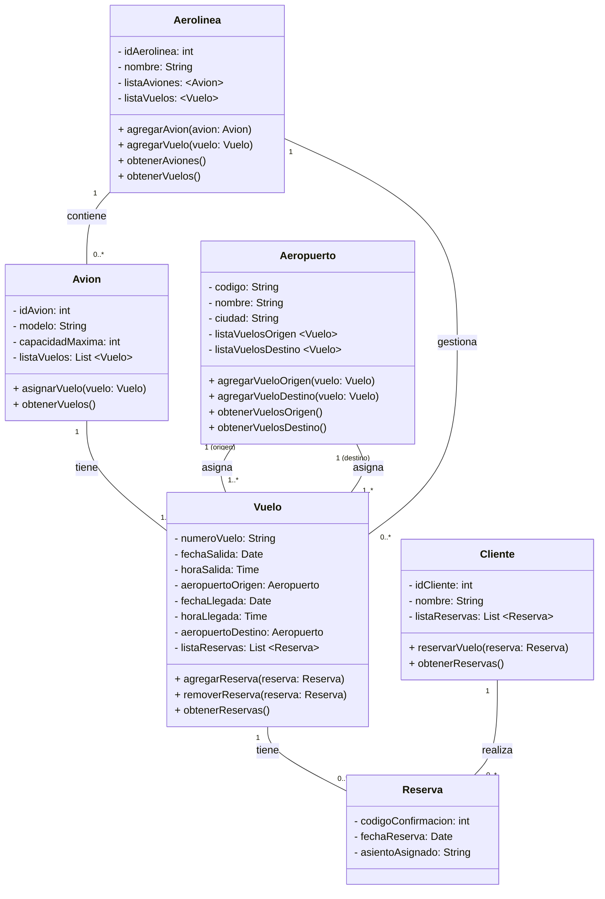

```mermaid

classDiagram
    class Vuelo {
        - numeroVuelo: String
        - fechaSalida: Date
        - horaSalida: Time
        - aeropuertoOrigen: Aeropuerto
        - fechaLlegada: Date
        - horaLlegada: Time
        - aeropuertoDestino: Aeropuerto
        - listaReservas: List ~Reserva~
        + agregarReserva (reserva: Reserva)
        + removerReserva (reserva: Reserva)
        + obtenerReservas ()
    }

    class Avion {
        - idAvion: int
        - modelo: String
        - capacidadMaxima: int
        - listaVuelos: List ~Vuelo~
        + asignarVuelo (vuelo: Vuelo)
        + obtenerVuelos ()
    }

    class Aerolinea {
        - idAerolinea: int
        - nombre: String 
        - listaAviones: ~Avion~
        - listaVuelos: ~Vuelo~
        + agregarAvion (avion: Avion)
        + agregarVuelo (vuelo: Vuelo)
        + obtenerAviones ()
        + obtenerVuelos ()
    }

    class Reserva {
        - codigoConfirmacion: int
        - fechaReserva: Date
        - asientoAsignado: String
    }

    class Cliente {
        - idCliente: int
        - nombre: String
        - listaReservas: List ~Reserva~
        + reservarVuelo (reserva: Reserva)
        + obtenerReservas ()
    }

    class Aeropuerto {
        - codigo: String
        - nombre: String
        - ciudad: String
        - listaVuelosOrigen ~Vuelo~
        - listaVuelosDestino ~Vuelo~
        + agregarVueloOrigen (vuelo: Vuelo)
        + agregarVueloDestino (vuelo: Vuelo)
        + obtenerVuelosOrigen ()
        + obtenerVuelosDestino ()
    }

    %% Relación entre clases
    

    Avion "1" -- "1..*" Vuelo : tiene
    Aeropuerto "1 (origen)" -- "1..*" Vuelo : asigna
    Aeropuerto "1 (destino)" -- "1..*" Vuelo : asigna
    Vuelo "1" -- "0..*" Reserva : tiene
    Cliente "1" -- "0..*" Reserva : realiza
    Aerolinea "1" -- "0..*" Avion : contiene
    Aerolinea "1" -- "0..*" Vuelo : gestiona


```